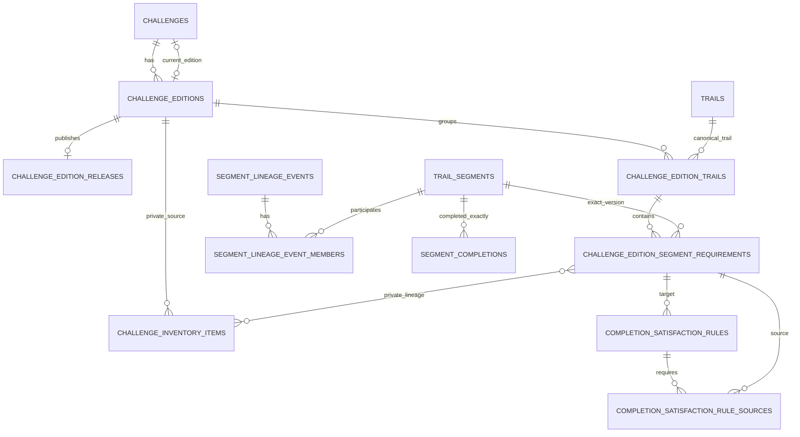

# M9 Architecture: Full Challenge Inventory + Edition/Versioning

## Purpose and scope

M9 remains **Full challenge inventory + edition/versioning**. Its contract is to introduce the complete privately verified challenge inventory, public-safe challenge editions, segment lineage, and historical versioning without changing the meaning or ownership of existing user completions.

This document is the implementation contract for the next milestone. It does not claim that the complete inventory is present, does not publish private inventory content, and does not authorize production database changes. M9 migrations should begin after migration 014 and use additive, reviewed steps.

## Core decisions

1. A **challenge** is the durable conceptual product identity. An **edition** is one immutable published requirement snapshot for that challenge.
2. An edition requirement points to one exact existing `trail_segments` row. Geometry is not copied into membership tables.
3. A published `trail_segments` row is an immutable **segment version**. Any geometric or semantic boundary change creates a new row/key.
4. Reusing the same segment row across editions is the only implicit statement that the requirement is unchanged.
5. Lineage records history; it never grants completion credit by itself.
6. Cross-version completion credit requires a separate explicit, reviewed satisfaction rule. No rule means no carryover.
7. `segment_completions` remains the factual owner record: a user completed this exact segment version. Existing rows are never remapped to successor segments.
8. Private verification/source truth and public-safe edition releases are separate projections and artifacts.

## Current-state model

### Database

- `trails.id` and `trail_segments.id` are bigint surrogate keys. `trails.production_trail_key` and `trail_segments.segment_key` are the durable published natural keys.
- `segment_completions` is unique on `(user_id, segment_id)` and currently references `trail_segments(id) ON DELETE CASCADE`. That delete behavior is incompatible with historical guarantees and must be replaced safely before M9 can retire/version segments.
- `completion_evidence.future_trail_segment_id` and reviewed evidence resolve the exact published segment key/version. Accepted evidence is immutable and remains evidence until explicit owner confirmation.
- Migration 005 already creates `challenge_editions` and `challenge_inventory_items`, but the edition is only a private reconciliation container (`edition_key`, `label`, `notes`). There is no durable challenge identity, lifecycle/current pointer, public projection, or segment membership.
- `challenge_inventory_items` are private trail-level source rows. They are not public requirements and do not identify junction-to-junction completion units.
- Migration 005 enables RLS and service-role read policies but does not normalize relation privileges with explicit revokes. M9 must do so before any owner-rights public view touches these relations.
- `trail_segment_api` currently represents the globally verified network, not an edition. Migration 014 minimizes its fields, but it would still combine every verified historical segment if M9 simply accumulated versions without edition scoping.
- The M8 publication loader refuses changes to an existing segment's parent, name, or geometry, which usefully protects identity. It still updates miles, provenance/status/review/publication linkage in place and does not retire omitted rows. M9 must tighten published-version immutability and make omission semantics edition-specific.

### TypeScript and repository layer

- `TrailSegment` carries the database segment ID as a string; production completion validation accepts positive PostgreSQL bigint strings only.
- `TrailRepository` has `listSegments`, `getSegmentBySlug`, `listTrails`, and `getTrailBySlug` with no challenge/edition argument.
- `SupabaseTrailRepository` reads `trail_segment_api`; `DemoTrailRepository` adapts the committed demo verified-network artifact.
- `aggregateTrailSegments` groups every segment returned by the repository, and progress is calculated directly from that complete list. M9 must scope the input list to an edition before aggregation/progress.
- `CompletionRepository` reads and mutates only the authenticated owner's exact completion rows. `applySegmentCompletions` performs exact segment-ID matching and correctly ignores completion rows absent from the selected public set.
- Static trail params and sitemap content are build-sensitive. A current-edition switch that adds/removes public trails requires a production rebuild under the current routing policy.

### Existing identifier behavior

- Publication v1 trail keys hash the private inventory item key plus normalized trail name.
- Publication v1 segment keys hash the trail key, construction candidate key, junction keys, and coordinates.
- These keys are appropriate immutable version identifiers, but recomputing them cannot prove equivalence: upstream inventory/candidate key changes can produce a different key without a real geometry change.
- Artifact UUID-shaped IDs are not loaded into production; service loaders resolve production bigint IDs using the published textual keys.

## Proposed domain model

### `challenges`

Durable conceptual identity, initially one White Mountains redlining challenge.

Proposed fields:

- bigint `id` primary key;
- immutable unique `challenge_key` and public unique `slug`;
- public-safe `name` and optional `summary`;
- nullable `current_edition_id`;
- lifecycle timestamps;
- internal notes kept off public projections.

The current pointer is mutable operational state, not part of an edition's historical facts. A constraint/controlled function must ensure the pointer belongs to the same challenge and references a published, non-withdrawn edition.

### Enriched `challenge_editions`

Extend the migration-005 table rather than replace it.

Proposed additive fields:

- nullable `challenge_id` during backfill, later required;
- immutable public `edition_slug` and manually approved `public_label`;
- `publication_status`: `draft`, `review`, `published`, or exceptional `withdrawn`;
- `published_at` and optional `withdrawn_at`;
- schema/version marker.

Preserve the existing `edition_key`, `label`, and `notes`. Existing label/notes remain private until specifically copied into approved public fields. Multiple published editions may coexist. A published non-current edition is historical and queryable; “superseded” is normally derived from `published && id != current_edition_id`, avoiding mutation of the old edition merely because a new one becomes current.

### `challenge_edition_releases`

One immutable audit record for a successfully published edition:

- edition FK (`ON DELETE RESTRICT`);
- release schema/algorithm version;
- public-release artifact fingerprint;
- private inventory/reconciliation fingerprints;
- diagnostics and controlled timestamps.

Fingerprints, diagnostics, paths, and source-review metadata are service/admin-only. A published release is append-only; a corrected edition receives a new edition/release rather than rewriting published facts.

### `challenge_edition_trails`

Edition-specific grouping of requirements under a canonical `trails` row:

- edition FK and trail FK (`ON DELETE RESTRICT`);
- stable `edition_trail_key` unique within the edition;
- public-safe display name, slug/ordering, and region presentation;
- unique `(edition_id, trail_id)` unless a reviewed future use case requires multiple groupings.

This layer permits edition-specific public labels without renaming a canonical trail row or changing historical pages.

### `challenge_edition_segment_requirements`

Exact edition membership:

- edition-trail FK and exact `trail_segments.id` FK (`ON DELETE RESTRICT`);
- stable `requirement_key` unique within the edition;
- public-safe segment label/order and optional requirement mileage override only if product-reviewed;
- required/retired-in-edition status, normally represented by membership presence rather than mutable flags.

Unique `(edition_id, segment_id)` prevents duplicate counting. The referenced segment supplies geometry; membership never duplicates it.

### `challenge_requirement_inventory_items`

Private many-to-many provenance between a public requirement and source inventory items. It answers how private source truth supports a public requirement without exposing the inventory row, source notes, protected wording, or source metadata.

### Lineage event model

Use `segment_lineage_events` plus `segment_lineage_event_members`, not names/slugs and not independent ambiguous edges.

Event fields include immutable `lineage_key`, change type, review status/time, reviewer, public-safe reason code, private notes, and optional source/target edition context. Members reference exact segment versions with role `predecessor` or `successor`.

Allowed cardinalities:

| Change | Predecessors | Successors | Completion effect |
| --- | ---: | ---: | --- |
| Unchanged | same segment ID reused | same segment ID reused | Direct exact-ID completion; no event needed. |
| Edition-only display rename | same segment ID reused | same segment ID reused | Direct; label lives on membership. |
| Canonical rename | 1 | 1 | None unless a satisfaction rule is approved. |
| Boundary change | 1 | 1 | None by default. |
| Reroute | 1 | 1 | None by default. |
| Split | 1 | 2+ | None by default; each successor needs its own rule. |
| Merge | 2+ | 1 | None by default; a rule may require all predecessors. |
| Retirement | 1+ | 0 | Historical edition/completion remains readable. |
| Introduction | 0 | 1+ | New requirement has no inherited completion. |

Published lineage facts are append-only. Correcting an erroneous event uses a reviewed superseding/retraction record rather than silently changing its members.

### Explicit completion satisfaction rules

Lineage and credit are deliberately separate. `completion_satisfaction_rules` targets one edition requirement and records a reviewed reason, lineage event, `match_mode` (`any` or `all`), approval state/time, and private notes. `completion_satisfaction_rule_sources` lists source edition requirements.

For a selected target requirement, it is satisfied when either:

1. the owner has a factual completion for `target.segment_id`; or
2. one published rule evaluates true against the owner's exact source-segment completions.

`all` supports an approved merge rule that requires all predecessor segments. Separate target rules support split decisions. Derived satisfaction never inserts or updates `segment_completions`.

## Historical completion semantics

- Existing completion rows keep their original bigint `segment_id`, owner, method, evidence link, date, and creation time.
- Do not add an edition ID to legacy rows and invent a backfill. A completion is challenge-independent evidence of completing an exact segment version; edition applicability comes from membership.
- If product later needs “edition selected at recording time,” add a separate nullable/context table for future events. It is not required for correct historical progress and is outside the first M9 foundation pass.
- Evidence remains attached to its original segment. Confirmation validates that exact version and never follows lineage automatically.
- Progress denominator is the selected edition's requirement count. Completed mileage sums the target edition's required segment mileage for satisfied requirements, never predecessor mileage.
- Switching the current edition changes the evaluated snapshot, not the factual completion rows. Historical editions retain their original denominator and remain queryable.
- A segment retired from the current edition remains visible within its historical edition and its completion remains intact.

## Privacy and authorization model

| Boundary | Data | Access |
| --- | --- | --- |
| Private verification truth | inventory rows/wording, source notes, reconciliation/topology decisions, requirement-to-inventory links, raw fingerprints/diagnostics, reviewer identity/private notes, lineage review evidence | `service_role`/controlled local-admin workflows only; explicit revokes from `PUBLIC`, `anon`, `authenticated` |
| Service operations | edition draft load, release validation, membership load, lineage/satisfaction-rule publication, current-edition switch | narrowly granted service RPCs/loaders; no hosted runtime service key |
| Authenticated user data | factual completions, private activities/evidence, derived edition progress | owner RLS and narrow owner-only RPC; no user ID accepted from callers when `auth.uid()` can be authoritative |
| Public-safe data | challenge key/slug/name, public edition key/slug/label/date/current flag, public trail/segment labels, region, miles, coordinates | curated owner-rights `security_barrier` views with exact allowlists and verified/published predicates |

Proposed public views:

- `challenge_api`;
- `challenge_edition_api`;
- `challenge_edition_segment_api`.

They must exclude inventory keys/items, source notes, full provenance, source feature IDs, artifact paths/fingerprints, diagnostics, reviewer identity, internal review notes, evidence, and user data. Normal hosted runtime continues to use only public Supabase URL/key configuration.

Authenticated derived progress should use a narrow `SECURITY DEFINER` RPC such as `list_challenge_edition_progress(edition_key)`. It derives the owner from `auth.uid()`, returns public requirement fields plus satisfaction status/reason, and grants no direct access to private rules or other users' completions.

## Versioning and immutability rules

1. Draft editions may be replaced during review; they are private and never returned from public views.
2. Publication validates every requirement against a verified/human-verified segment and freezes edition fields, groupings, memberships, release facts, public labels/order, lineage facts, and published satisfaction rules.
3. Published editions and memberships cannot be updated or deleted through ordinary loaders. Corrections create a new edition, except an exceptional withdrawal that hides unsafe facts without deleting them.
4. Only one current edition exists per challenge. Switching the pointer is an atomic controlled operation after release acceptance.
5. Existing `segment_key`, `production_trail_key`, slugs, bigint IDs, completion FKs, evidence FKs, and activity references are preserved.
6. Reuse an existing segment version only with an explicit reviewed identity-reuse manifest confirming exact geometry, boundaries, parent semantics, and completion meaning. Do not regenerate v1 keys merely because upstream private keys changed.
7. Any changed geometry/boundary/meaning receives a new segment row/key and explicit lineage. Names/slugs alone never establish identity or equivalence.
8. Published trails/segments referenced by editions or completions are non-deletable. Retirement is status/membership history, not deletion.

## Additive migration and rollout plan

No step should mutate production until its migration, loader, security tests, and rollback approach have been reviewed. Run on a disposable clone first.

1. **Preflight and snapshot**
   - Verify production migrations, owners, grants, PostGIS schema, stable keys, segment/completion/evidence counts, FK definitions, and current API output.
   - Capture the exact current verified/human-verified network and per-user aggregate invariants without exporting private user data.
2. **Migration 015: challenge/edition foundation**
   - Create `challenges`.
   - Add nullable challenge/public lifecycle fields to `challenge_editions`.
   - Create edition release, trail grouping, exact segment requirement, and private inventory-lineage tables with RLS, explicit revokes, and `ON DELETE RESTRICT`.
   - Add no public grants and no current pointer yet.
3. **Loader compatibility**
   - Add version-aware controlled loaders that resolve textual keys, validate verified segments, distinguish identity reuse from new versions, reject demo/private-public mixing, and refuse published-edition mutation.
   - Keep the existing M8 loader operational until the baseline cutover is proven.
4. **Historical deletion/immutability safety**
   - Validate there are no orphan completions.
   - Replace the `segment_completions.segment_id ON DELETE CASCADE` FK with `ON DELETE RESTRICT/NO ACTION` in a measured migration.
   - Add guards preventing deletion or semantic mutation of published/referenced trail and segment versions. Deploy loader compatibility first so these guards do not break legitimate workflows.
5. **Controlled baseline backfill**
   - Create one private draft baseline edition containing exactly the currently public verified network by existing bigint IDs/segment keys.
   - Do not touch completion/evidence rows, geometry, trail/segment IDs, keys, or slugs.
   - Compare membership counts, miles, trail groupings, bounds, and public payloads with the existing projection.
6. **Public-safe projections and baseline publication**
   - Create the three allowlist public views with no private fields.
   - Publish the validated baseline edition and set the challenge current pointer atomically.
   - Keep historical editions queryable by explicit key; exclude draft/review/withdrawn editions.
7. **Repository/application cutover**
   - Add challenge/edition domain types and a separate `ChallengeRepository`.
   - Scope trail repository reads, aggregation, map, directory, detail, sitemap, and progress to an explicit current or selected edition.
   - Keep a compatibility `trail_segment_api` limited to the current edition until all callers move, then revoke or redefine it; never let it become the union of historical versions.
8. **Lineage and derived progress**
   - Add lineage event/member and satisfaction rule/source tables.
   - Publish no automatic rules by default.
   - Add the owner-only progress RPC and application repository; retain exact factual completion persistence.
9. **Full private inventory edition**
   - Load the legally reviewed full inventory only through ignored local inputs and service-controlled tooling.
   - Reconcile/build/verify segments, explicitly reuse unchanged identities, create new versions for changed semantics, and record lineage/credit decisions.
   - Publish the new edition as non-current first.
10. **Acceptance and current-edition switch**
    - Run database/security/compatibility tests and compare historical/current progress.
    - Switch current only after human acceptance.
    - Rebuild the Next application so static trail params, sitemap, metadata, and route inventory reflect the selected release.

### Production rows affected

- Steps 2-3 are additive except nullable columns and grant normalization on currently private reconciliation tables.
- Step 4 changes the completion-to-segment FK delete action and adds immutability guards; it does not rewrite completion rows but may require a short table lock and clone timing tests.
- Step 5 inserts challenge/edition/membership facts only.
- No plan step updates existing `segment_completions.segment_id`, `completion_evidence.future_trail_segment_id`, geometry, stable keys, or ownership.
- The current-edition pointer and repository cutover are the only changes that alter default public denominators; they occur after baseline parity.

## Repository and API impact

### Domain/types

Add `Challenge`, `ChallengeEdition`, `EditionTrail`, `EditionSegmentRequirement`, `SegmentLineageEvent`, and derived `RequirementSatisfaction` types. Keep `TrailSegment` and `SegmentCompletion` as exact segment-version/factual completion types.

### Repositories

- Add `ChallengeRepository` for public challenge/edition discovery.
- Make public trail listing accept an explicit edition key or provide a clearly named current-edition method.
- Keep `CompletionRepository` unchanged for exact completion writes.
- Add an authenticated `ChallengeProgressRepository` around the owner-only derived progress RPC.
- Never join private completion state into cacheable public views.

### Aggregation/routes

- Aggregate edition trail groupings rather than every globally verified segment.
- `/`, `/trails`, default detail pages, robots/sitemap, and canonical metadata use the challenge's current public edition.
- Historical edition routes/parameters, if product-approved, use explicit edition keys and do not become canonical defaults.
- A current-edition change requires a build/promotion under the existing static-param contract.

### Database/RPCs

- Curated public edition views expose exact allowlists.
- Service loaders resolve stable text keys internally and return counts/fingerprints only.
- Progress RPC derives `auth.uid()`, exact completion matches, and reviewed carryover rules without exposing private rows.
- Evidence list/confirm RPCs keep exact-version semantics; lineage is not consulted during evidence confirmation.

### Admin/local publication tooling

Split output into:

1. private verification/reconciliation material containing source truth and review evidence; and
2. a separately validated public-safe edition release manifest containing only approved labels, ordering, stable published keys, and memberships.

All real inventory inputs remain ignored under `data/local/challenge-inventory/`. Proposed/accepted reconciliation and construction candidates remain non-published until the existing human verification gate succeeds.

## Test and acceptance plan

### Schema/versioning

- Clean migration 001 through the complete M9 chain twice on disposable Supabase/Postgres.
- Baseline edition has semantic parity with the current production public network.
- Current pointer cannot target another challenge or an unpublished/withdrawn edition.
- Published edition fields, groupings, memberships, releases, lineage, and credit rules cannot mutate/delete.
- Completion segment FK is restrictive; deleting/replacing a segment cannot erase completion history.

### Edition behavior

- Draft/private edition is invisible to anon/authenticated public reads.
- Published historical edition remains readable but is not the default.
- Multiple published editions coexist; exactly one is current per challenge.
- Retired segment remains in the historical edition and is absent from the new denominator.
- New segment affects only editions that include it.

### Lineage and completion

- Identical segment reused across editions counts directly once.
- Edition-only renamed label with the same segment counts directly.
- New segment version with rename lineage does not count without a reviewed rule.
- Boundary change and reroute do not carry automatically.
- Split grants no implicit credit; each approved successor rule evaluates independently.
- Merge `all` rule requires every approved predecessor; `any` is used only by explicit product decision.
- Completion under an old edition remains attached to its original segment and historical progress remains stable.
- Derived satisfaction creates no completion or evidence row and never retargets evidence.
- Progress percentages/counts/miles use the selected edition denominator and target requirement mileage.

### Security/privacy

- Test through anon, authenticated user A, authenticated user B, and service-role contexts.
- No cross-user completion, activity, evidence, or derived-progress leakage.
- Inventory items, source notes, private wording, artifact paths/fingerprints, diagnostics, reviewer identity, raw provenance, source feature IDs, and private lineage/credit notes never appear in public REST/RPC output.
- Browser roles cannot access private/base tables or service loaders.
- Hosted runtime contains no service-role key and fails closed if public production repository configuration is missing.

### Application/regression

- Current and historical repository selection and trail aggregation.
- Map/list synchronization, public directory/detail rendering, completion mark/unmark, and explicit evidence confirmation.
- Static trail params, sitemap/canonical/noindex behavior for current vs. historical editions.
- Demo/private artifacts remain excluded from production.
- M10 substrate query returns the selected edition's incomplete requirements with public geometry, region, and trail grouping while excluding historical/non-required segments.

Static migration-contract tests are necessary but insufficient. Production acceptance requires live PostgreSQL/PostgREST RLS, grants, RPC ownership, function search paths, races, and exact response-column tests on a disposable environment first.

## Open product decisions for James

1. Public challenge name/key/slug and the public labels for the baseline and first full editions.
2. Whether historical edition pages should be indexable, `noindex, follow`, or account-only discoverable while still publicly readable.
3. Whether users can select/persist a preferred edition in M9, or whether the first release supports only global current plus explicit historical browsing.
4. Carryover policy for boundary changes, reroutes, splits, and merges. Recommended default: no credit without an explicit reviewed rule.
5. Whether a completion recorded after a segment leaves the current edition can satisfy a later edition through an already published rule.
6. Primary progress display: segment count is recommended, with required-edition mileage secondary.
7. Exact public-safe attribution/edition wording that can be published without reproducing protected guide prose.
8. Exceptional withdrawal policy when a published edition or segment is found materially wrong.
9. Whether recording selected-edition context for future completions has product value. It is not required for historical correctness and must not be fabricated for legacy rows.

## First M9 implementation pass

The repository is ready for a bounded first M9 pass limited to preflight tooling, migration-015 foundation tables/constraints/grants, domain types, and a private baseline-edition builder/validator. That pass should not load the full inventory, switch the public repository, change current progress, add automatic lineage credit, or mutate production. The next gate is a reviewed baseline parity artifact and disposable database acceptance.
